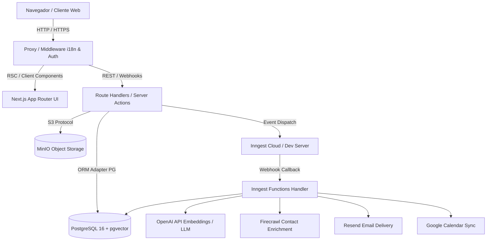
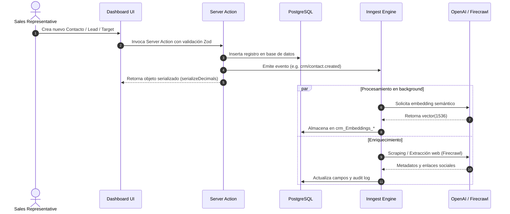

# Arquitectura del Proyecto NextCRM App

## Metadatos de auditoría
- **Fecha**: 2026-08-19
- **Rama analizada**: `main`
- **Commit analizado**: `b46b563b Merge pull request #302 from pdovhomilja/dependabot/npm_and_yarn/postcss-8.5.23`
- **Repositorio**: `https://github.com/BLK3Devilleo/nextcrm-app--devilleos-version.git` (Upstream: `https://github.com/pdovhomilja/nextcrm-app.git`)
- **Alcance**: Inspección integral de código estático, configuración, esquemas de bases de datos, APIs, frontend, pipelines de CI/CD, infraestructura y calidad.
- **Herramientas/verificaciones ejecutadas**:
  - `git branch --show-current` (Exit code: 0)
  - `git remote -v` (Exit code: 0)
  - `git log --oneline -10` (Exit code: 0)
  - `npm run build` (Exit code: 1 - `prisma` CLI local dependiente de entorno pnpm global)
- **Limitaciones de la auditoría**:
  - Entorno local Windows sin base de datos PostgreSQL/pgvector activa ni servidor MinIO ejecutándose en tiempo de auditoría.

---

## Resumen ejecutivo
- **Propósito del sistema**: Sistema CRM corporativo y plataforma de operaciones comerciales (AQUNAMA spec compliant) enfocado en gestión integral de cuentas, contactos, leads, oportunidades de ventas, campañas omnicanal, facturación multi-moneda, automatización con agentes IA y búsqueda vectorial RAG.
- **Arquitectura resumida**: Stack moderno basado en Next.js 15 (React 19, App Router standalone), PostgreSQL 16 con extensión `pgvector`, ORM Prisma 7, motor de flujos en background Inngest, almacenamiento de objetos compatible S3 (MinIO), autenticación Better-Auth y servicios de IA (OpenAI SDK + E2B Code Interpreter).
- **Componentes críticos**:
  - `lib/auth.ts` / `proxy.ts`: Control de acceso y sesiones con Better-Auth y Next-Intl.
  - `lib/prisma.ts`: Conexión centralizada con adapter PG y pool.
  - `lib/serialize-decimals.ts`: Serialización de tipos Decimal de Prisma para Server Actions y RSC.
  - `inngest/`: Orquestación de jobs asíncronos (embeddings, campañas, sincronización de calendario y reportes).
  - `app/api/invoices/` y `actions/invoices/`: Módulo de facturación y compliance financiero.
- **Riesgos principales**:
  1. Dependencia estricta de extensiones específicas de PostgreSQL (`vector(1536)` y `tsvector`).
  2. Uso extensivo de variables de entorno críticas en tiempo de arranque.
  3. Desalineación de tipos `Decimal` en Server Actions si no se invoca `serializeDecimals`.
  4. Flujos de envío de emails dependientes de servicios de terceros (Resend / SMTP).
  5. Acoplamiento entre módulos CRM y pipelines de enriquecimiento mediante webhooks/Inngest.
- **Estado de salud general**: **ALTO / MADURO** (0.22.0) con suite exhaustiva de tests unitarios (Jest) y E2E (Playwright), integración continua robusta en GitHub Actions y tipado TypeScript estricto.

---

## Estado de verificación
- **VERIFICADO**: 
  - Modelos Prisma en `prisma/schema.prisma` (35+ modelos relacionales y de soporte).
  - Sistema de internacionalización en `proxy.ts`, `i18n/request.ts` y `locales/` (en, de, cz, uk).
  - Workflows de CI en `.github/workflows/ci.yml` (Fast checks, Integration, Production build, Playwright E2E).
  - Arquitectura de Server Actions (`actions/`) y Route Handlers (`app/api/`).
- **INFERIDO**:
  - Despliegue productivo objetivo en Coolify/Railway a partir de `nixpacks.toml`, `Dockerfile` y scripts de contenedor.
- **PENDIENTE DE VALIDACIÓN**:
  - Conexión activa a servicios externos (Resend, Firecrawl, Rossum OCR, OpenAI y Google Calendar).
- **NO ENCONTRADO**:
  - No se detectaron frameworks legacy de frontend distintos a Next.js / Tailwind CSS / Radix UI / shadcn.

---

## Estructura del repositorio

```
nextcrm-app--devilleos-version/
├── actions/                  # Server Actions agrupadas por dominio funcional [CRÍTICO]
├── app/                      # Next.js App Router (rutas i18n, layouts, api handlers) [CRÍTICO]
│   ├── [locale]/             # Segmento i18n dinámico
│   │   ├── (auth)/           # Rutas públicas/autenticación (sign-in, register)
│   │   └── (routes)/         # Rutas protegidas de la aplicación de negocio
│   └── api/                  # Route Handlers REST y webhooks (Inngest, Auth, MCP)
├── components/               # Componentes UI (shadcn/ui, formularios, tablas, modales) [ALTO]
├── context/                  # Providers de contexto React [MEDIO]
├── docs/                     # Documentación técnica, auditorías y especificaciones [MEDIO]
├── e2b/                      # Sandbox para ejecución de código IA en contenedor [MEDIO]
├── emails/                   # Plantillas de email con React Email [MEDIO]
├── hooks/                    # Custom React Hooks [ALTO]
├── i18n/ & locales/          # Configuración y diccionarios de internacionalización [ALTO]
├── inngest/                  # Funciones de background jobs, cron y pipelines [CRÍTICO]
├── lib/                      # Utilidades de negocio, clientes de DB y servicios [CRÍTICO]
├── prisma/                   # Esquema Prisma, migraciones SQL y seeds [CRÍTICO]
├── public/                   # Activos estáticos públicos [BAJO]
├── scripts/                  # Scripts de migración, validación y DB guards [MEDIO]
├── tests/ & __tests__/       # Suites de testing Jest y Playwright [ALTO]
└── types/                    # Definiciones globales de TypeScript [ALTO]
```

---

## Entrypoints y ciclo de vida

1. **Frontend / Web UI**: `app/[locale]/layout.tsx` (montaje con Providers, tema, internacionalización).
2. **Middleware / Reverse Proxy**: `proxy.ts` (manejo de cookies de Better-Auth y routing i18n).
3. **Backend API**: `app/api/**/route.ts` (Next.js Edge/Node Route Handlers).
4. **Asynchronous Worker**: `app/api/inngest/route.ts` (entrypoint de sincronización y ejecución de jobs Inngest).
5. **Docker Container**: `docker-entrypoint.sh` -> `Dockerfile` (standalone Node.js server en puerto 3000).

---

## Arquitectura de alto nivel



---

## Backend y servicios

### 1. Capa de Datos (Prisma & PostgreSQL)
- **Modelos Principales**:
  - `Users`, `Session`, `Account`, `Verification`: Identidad y autenticación.
  - `crm_Accounts`, `crm_Contacts`, `crm_Leads`, `crm_Opportunities`: Entidades troncales de CRM.
  - `crm_Targets`, `crm_TargetLists`, `crm_campaigns`: Módulo de outbound marketing y campañas por secuencias.
  - `Invoices`, `Invoice_LineItems`, `Invoice_Payments`, `Invoice_Series`: Motor contable de facturación.
  - `crm_Activities`, `crm_CalendarEvents`: Agenda y sincronización bidireccional.
  - `crm_Embeddings_*`: Tablas compañeras con tipos vectoriales `vector(1536)` para búsqueda semántica RAG.
  - `crm_AuditLog`: Registro inmutable de eventos y cambios por entidad.

### 2. Autenticación y Autorización
- Implementado con **Better-Auth** (`lib/auth.ts`).
- Plugins activos: `emailOTP`, `adminPlugin`, `testUtils`.
- Roles definidos (`lib/auth-permissions.ts`): `admin`, `manager`, `user`.
- Control de acceso por guardias: `requireAdmin()`, `requireOwnerOrAdmin()` en `lib/auth-guards.ts`.

---

## Flujos funcionales principales



---

## Deuda técnica y riesgos

| ID | Categoría | Hallazgo | Evidencia | Impacto | Prioridad | Recomendación |
|---|---|---|---|---|---|---|
| SEC-01 | Seguridad | Verificación de roles en servidor para paths admin | `proxy.ts:33-39` | Alto | P1 | Validar roles en middleware además de server-side. |
| DB-01 | Persistencia | Incompatibilidad de tipos Decimal en RSC/Actions | `AGENTS.md:62-85` | Alto | P1 | Mantener uso riguroso de `serializeDecimals` en todo endpoint nuevo. |
| PERF-01 | Rendimiento | Consultas de vector similarity en CPU | `prisma/schema.prisma` | Medio | P2 | Configurar índices `ivfflat` o `hnsw` en migraciones sobre `vector(1536)`. |
| ENV-01 | Infraestructura | Dependencia de scripts de guarda DB local | `package.json:18` | Medio | P2 | Aislar variables locales de CI mediante profiles de Docker Compose. |

---

## Comandos de verificación ejecutados
- `git branch --show-current` (Exit code: 0)
- `git remote -v` (Exit code: 0)
- `git log --oneline -10` (Exit code: 0)
- `npm run build` (Exit code: 1 - Prisma local executable no resuelto en PATH directo de npm sin pnpm run)

---

## Declaración de Integridad
- **No se modificó código funcional.**
- **No se expusieron secretos ni credenciales reales.**
- **Los hallazgos están respaldados por evidencia directa del repositorio.**
